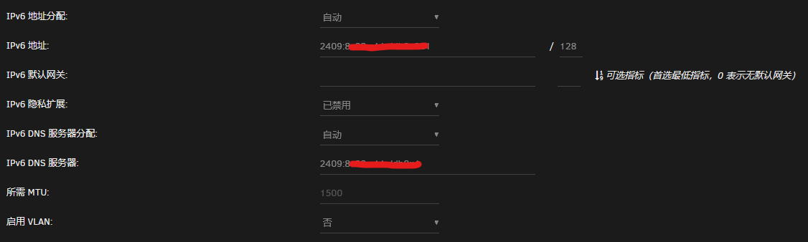
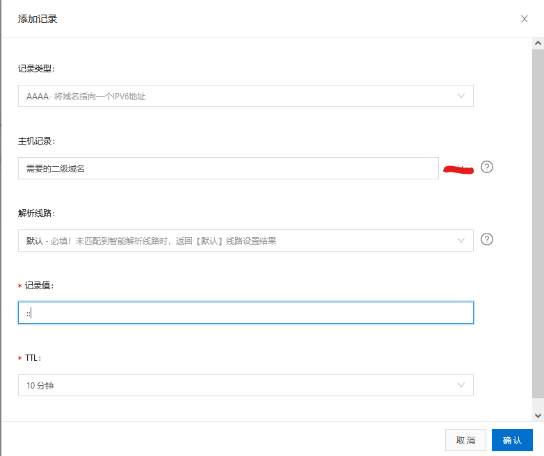
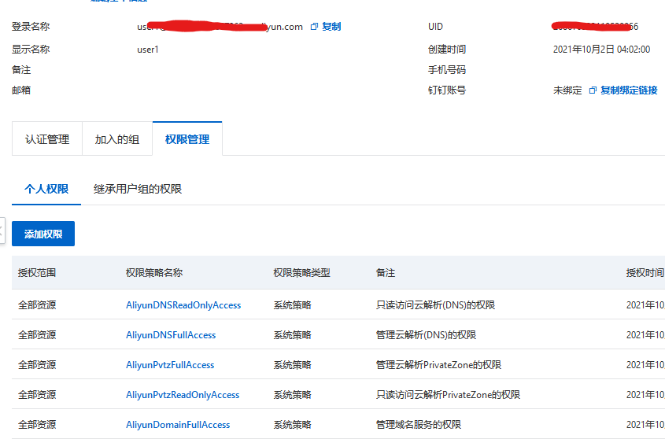
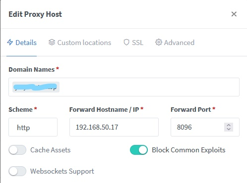
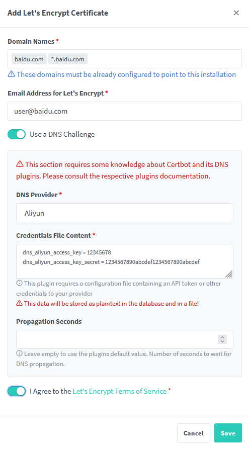
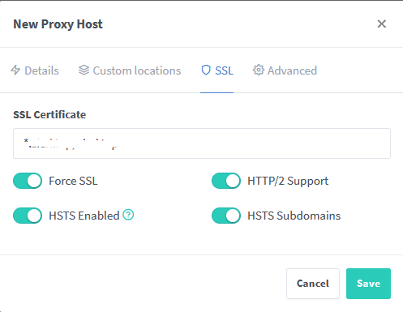

# 配置NAS基于IPv6的外网访问

首先提示：
- 把ip暴露在公网上有风险
- 比如勒索病毒可能会看上你
- 建议防火墙配置好
- 路由器Openwrt、NAS：Unraid
- 本文用到Docker应用：DDNS-GO、NPM

---

[toc]  

---

## 配置IPv6外网访问

- 移动要不到公网IP
- 缺点是访问端必须要支持IPv6
	- 比如公司网络大多没有IPv6，只能4转6

### 原理

- 由于国内网络默认封80、443端口，只能通过非常见端口访问
- 和IPv4不同，不需要路由器暴露在外网
	- IPv4是外网访问路由器的拨号的公网IP（路由器设置DDNS），然后路由器通过端口转发，把公网的请求转发到内网的某个设备上
	- 比如请求的是`111.18.63.14:8080`，路由器开启`端口转发`功能，将`111.18.63.14:8080`的请求转发至内网的`192.168.0.111:8080`上。
- IPv6每一个设备都可以分配一个公网IP
- 所以路由器端不用设置端口转发
- 只需要设置防火墙的`通信规则`功能，放行特定的端口就行，
- 需要外网访问的设备（Unraid）开DDNS。

### Openwrt具体配置

- [OpenWRT的IPv6设置](../../undefined#IPv6)

- [OpenWRT的防火墙设置](../../undefined#防火墙)

### Unraid设置

#### IPv6设置

设置—>网络设置—>网络协议—>IPv4+IPv6—>应用

查看IPv6地址，移动：`2409`开头的就好。



#### 更改默认端口

由于国内网络默认封80、443端口，需要更改其他端口才能使用

设置—>管理权限—>修改http/https端口—>应用

然后在流量状态下，通过`[IPv6地址]:端口`就可以访问Unraid了

_这里只是检测一下是否成功，测试以后可以把端口改回去，后面有更好的方法：反向代理。_

## 配置域名配合DDNS

- 域名可以使访问更方便
	- IPv4记住倒还好说，IPv6非常困难
	- 挑.top后缀的,买一个也很便宜
- 然后我们获得的公网IP是活动的
	- 路由器断电，或者过段时间，自己就会变化
- DDNS功能就是检测到你的IP变化时，告诉你（或者自动替换域名绑定的地址）

### 域名

#### 域名相关

1. 在各个平台购买域名，一般[腾讯云](https://dnspod.cloud.tencent.com/?from=qcloudHpProductDns/)、或者[阿里云](https://wanwang.aliyun.com/?spm=5176.19720258.J_8058803260.55.54212c4aeXMZLy)都行。
2. 购买完成以后，右上角点击`控制台`，点击`云解析DNS`，点击`解析设置`
3. 点击`添加记录`，由于我们时IPv6，所以记录类型选择：AAAA，其他如图：
	- 记录值随便填下就好，DDNS会自动更新的。
	- `@`表示不带任何前缀的域名
	- `*`表示泛域名，一般用于https的证书申请
	

#### 创建子用户

1. 点击创建阿里云的[AccessKey](https://ram.console.aliyun.com/manage/ak?spm=5176.12818093.nav-right.dak.488716d0mHaMgg)
2. 建议使用子用户的AccessKey，安全些
3. 创建的子用户需要这些权限：
	
4. 然后复制给你的AccessKey
5. 保存好，**只出现一次**

### DDNS

1. DDNS可以用Docker应用，部署方便
2. 有很多类似，这里用的是`ddns-go`
3. 部署详见[ddns-go](../../undefined)

#### DDNS内设置

1. 需要填写DNS服务商的AccessKey
2. IPv4不启用
3. IPv6启用，选择通过网卡获取。
4. Domains填写需要的域名见[ddns-go](../../undefined)
5. 其他配置可以选择禁止公网访问
6. 设置登录用户名和密码
7. 点击保存

右侧出现更新IP说明正常了，现在可以尝试用域名访问了
如果觉得不保险，可以登录对应的DNS解析页面，可以看到`记录值`已经更新

## 配置反向代理

### 不通过反向代理访问

- 可以不通过反向代理直接访问，但是有缺点。
- 简单原理如下：
	```mermaid
	graph LR
		网络 --> 路由器防火墙 --> Docker其他容器
	```

#### 直接访问

- 在DNS解析设置里，所有的网址对应的都是同一个值
- 这就是我们Unraid的电脑IP（IPv6）
- 如果想要访问我们内置的Docker应用
	- 假如jellyfin的网络类型为`host`
	- 假如jellyfin的webUI访问端口时8096
	- 设置的域名为jellyfin.baidu.com
- 只能使用网址+对应的端口号来访问
	- `http://jellyfin.baidu.com:8096`

#### 问题

1. 问题1： host模式
	- 上述条件有一点需要注意
	- 网络类型必须设置为`host`，而不能时`bridge`
	- 因为Unraid现在的Docker版本为20.10.5，该版本不支持IPv6
	- 使用bridge或者其他自定义网络的Docker应用，跑在IPv4上
	- 所以无法直接连接
3. 问题2：端口冲突
	- host模式的Docker应用不支持端口转发
	- 也就是说一个Docker应用默认端口是8080，他使用了这个端口
	- 其他Docker应用在host模式下就不能使用该端口
	- 如果Docker应用比较多的话不能采用这种方式
4. 问题3：安全
	- 使用这种方式访问需要在防火墙放行对应端口
	- 8080这种端口先不说移动电信封不封
	- 这种常用的端口容易被扫描，非常不安全

### 通过反向代理访问

- 反向代理软件有很多，nginx、traefik、swag。
- 我这边使用的是nginx
- 由于nginx是命令行，默认没有GUI界面
	- 可以使用三方带GUI，如：
	- [NginxWebGUI研究](../../undefined)
	- [NginxProxyManager](../../undefined)
- 简单原理如下：
	```mermaid
	graph LR
		网络 --> 路由器防火墙 --> Nginx -- 内网络 --> 其他Docker应用
	```

#### 部署
- 这里的Nginx也可以是Docker应用，我用[NPM](../../undefined)
	- 需要设置网络类型为`host`
	- 需要默认端口不是80、443
	- 比如http或https端口为12352
	- 在nginx里设置反向代理规则（Proxy Hosts）：
	- `jellyfin.baidu.com`至局域网的`192.168.1.1:8096`
	
- 我们外网请求地址`jellyfin.baidu.com:12352`
- 访问请求到nginx，nginx一看内部有对应规则
- 就把这个请求转发到内网的`192.168.1.1:8096`
- 我们就可以进入jellyfin的WebUI实现访问

#### 优缺点

1. nginx需要默认默认有非常规的端口
	- 由于网络模式为host，无法更改端口
	- 所以需要docker容器默认是非常规端口
2. 其他应用端口无限制
	- 除了nginx以外其他应用网络可以设置为bridge
	- 端口可以随意转发，无限制
4. 防火墙放行端口少
	- 防火墙只需要放行nginx的对应端口
	- 不需要开启其他的端口，相对较为安全

## 配置https加密访问

- 我们这样设置完成以后默认访问方式是http
- 这种访问方式数据在网络上的各个节点传输时是明文（没有加密过的）
- 非常的不安全，所以我们需要开启https，使用加密传输
- https使用，需要申请SSL证书，一般是一个证书一个密钥
- 这个证书有有效期

###  阿里云免费的SSL证书

- 阿里云可以申请免费的SSL证书
- 每个证书有效期12个月还是6个月
- 但是每一个二级域名都需要申请一个证书
- 就是`jellyfin.baidu.com`和`qb.baidu.com`
- 这两个域名需要申请两个证书
- 不支持申请免费的泛域名证书`*.baidu.com`
- 比较麻烦

### 使用Let's Encrypt

- Let's Encrypt是免费、开放和自动化的证书颁发机构
- 但是申请的证书有效时间比较短，3个月
- 可以申请泛域名证书，只需要申请一个证书就好了
- `*.baidu.com`，`baidu.com`
- 写上这两个域名就可以不用申请别的了
- 有许多自带了这个功能的Docekr应用
- 比如NPM自带了Let's Encrypt

#### NPM申请SSL证书

- 进入NPM界面后点击`SSL Certificates`，点击`Add SSL Certificate`，点击`Let's Encrypt`
- 填写`Domain Names（域名）`，填写`Email Address for Let's Encrypt（电子邮件地址）`
- 由于我们80端口被关闭了，所以选择`Use a DNS Challenge（使用DNS验证）`
- 填写`DNS Provider（DNS运营商）`，这里是`Aliyun`
- `Credentials File Content (凭证文件内容)`为：
	```
	dns_aliyun_access_key = 11111
	dns_aliyun_access_key_secret = 111111
	```
	- 可以使用[DDNS-GO](#DDNS)的值
	- 复制那两个AccessKey两个值就好
- `Propagation Seconds(传播秒数)`留空
- 同意`I Agree to the Let's Encrypt Terms of Service`
- 点击`Save（保存）`就完成了
	

#### 开始https访问

- 在设置反向代理中启用SSL就可以开启https访问
- 点击Dashboard，点击Porxy Hosts，点击Add Proxy Host，点击SSL
- 在`SSL Certificate`选择我们已经申请的证书，然后开启下面的四个选项，建议开启第一个`Force SSL（强制SSL）`
- 点击保存，就完成了加密访问
	


